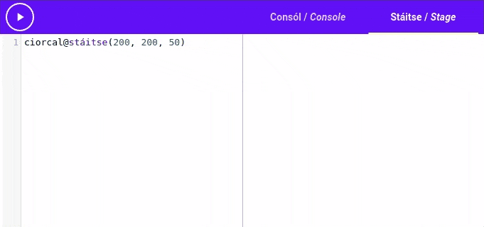
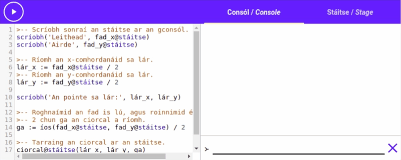

# Gníomhartha

Le tosú ag tarraingt cruthanna ar an stáitse, is gá dúinn féach ar **gníomhartha**.

Chonaiceamar cúpla gníomhartha cheana, ba gníomh é `scríobh`{.setanta}, chomh maith le
`codladh`{.setanta}.

Is luachanna speisialta iad gníomhartha a sheasann do rudaí casta is féidir leis an ríomhaire a
dhéanamh. Sa chás `gníomh`{.setanta} mar shampla, is é an rud casta téacs a scríobh ar an gconsól
agus sa chás `codladh`{.setanta}, is é ag fanacht ar feadh am éigin.

Amach anseo, feicfimid conas ár ngníomhartha féin a chruthú, ach anois feicfimid ar an caoi is
féidir linn iad a úsáid.

## Glaoigh Orm!

Nuair a bainimid úsáid as gníomh, deirimid go bhfuilimid **ag glaoch** air. An cuimhin leat an caoi
a d'úsáideamar an gníomh `scríobh`{.setanta}?

```{.setanta .numberLines}
scríobh("Scríobh mé ar an gconsól")
```

Nuair a léann léirmhínitheoir *Setanta* "`scríobh("Scríobh mé ar an gconsól")`{.setanta}", glaonn sé
ar an gníomh `scríobh`{.setanta} agus tugann sé an téacs `"Scríobh mé ar an gconsól"`{.setanta} dó.

Tugaimid "**argóint**" ar an téacs idir na lúibíní. Sa chód thuas, is é
`"Scríobh mé ar an gconsól"`{.setanta} an argóint do `scríobh`{.setanta}

Sa chód a leanas, ba `2000`{.setanta} an argóint do `codladh`{.setanta}.

```{.setanta .numberLines}
codladh(2000)
```

Nuair a ritear an cód seo, tugann an ríomhaire `2000`{.setanta} don gníomh `codladh`{.setanta} agus
ansin glaonn sé air. Ansin fanann an léirmhínitheoir ar feadh dhá soicind.

### Níos mó argóintí

Is féidir le roinnt gníomhartha i *Setanta* níos mó ná argóint amháin a ghlacadh. Nuair a tugaimid
níos mó ná argóint amháin do gníomh éigin, bainimid úsáid as camóg ("`,`") chun iad a scaradh.

Mar shampla, is féidir le `scríobh`{.setanta} an oiread argóintí agus is mian linn a ghlacadh, agus
scríobhfaidh sé gach ceann ar an gconsól le spás eatarthu. Bain triail as anseo:

{{{
scríobh("An-chéad-argóint", "An-dara-argóint")
}}}

Ní féidir le gach gníomh an oiread argóintí agus is mian linn a ghlacadh. Glacann an gníomh le
argóint amháin, ní ghlacann sé le aon méid argóinte eile.

Is féidir le roinnt argóintí 0 argóintí a ghlacadh.

## Dúshlán

Anois triailimis ár n-eolas ar gníomhartha!

Seo cód a úsáideann `scríobh`{.setanta} chun "Is aoibhinn liom Setanta!" a scríobh. Athraigh an cód
ionas go fós scríobhann sé "Is aoibhinn liom Setanta!" ach baineann sé úsáid as ceithre athróg ina
ionad sin.

{{{
scríobh("Is aoibhinn liom Setanta!")
}}}

[[Cliceáil anseo le haghaidh an freagra|scríobh(&quot;Is&quot;, &quot;aoibhinn&quot;, &quot;liom&quot;, &quot;Setanta!&quot;)]]

## Torthaí

Nuair a glaoitear ar roinnt gníomhartha i *Setanta* tugann siad luach éigin ar ais. Tugaimid "toradh
an ghnímh" ar an luach sin.

Seo sampla beag chun a bheith níos soiléire: Tá gníomh `uas`{.setanta} ag *Setanta*. Is giorrúchán é
`uas`{.setanta} ar "uasmhéid".

Cad a dhéanann `uas`{.setanta}?. Glacann `uas`{.setanta} le dhá uimhir agus tugann sé ar ais an
ceann is mó.

Mar shampla: Is é `3`{.setanta} toradh an tsloinn `uas(3, 2)`{.setanta}.

Is féidir linn toradh ghnímh a chur in athróg, mar seo:

```{.setanta}
is_mó := uas(3, 2)
```

Sa chás seo, ba é `3`{.setanta} luach an athróg `is_mó`. Bain triail as:

{{{
is_mó := uas(3, 2)
scríobh(is_mó)
}}}

Bain triail as luachanna difriúil, mar shampla, cad a scríobhfadh an cód dá gcuirfeá
`uas(100, 200)`{.setanta} in ionad `uas(3, 2)`{.setanta}.

*Tabhair faoi deara go féidir linn `scríobh(uas(3, 2))`{.setanta} a scríobh, ag úsáid toradh
`uas`{.setanta} díreach mar argóint `scríobh`{.setanta}*.

### Sampla

Sa réamhrá, chonaiceamar an cód seo:

```{.setanta .numberLines}
ainm := ceist("Cad is ainm duit?")
scríobh("Dia duit", ainm)
```

Anois is féidir linn a thuiscint cad atá ar siúl.

1. Ar an gcéad líne, úsáidimid an gníomh `ceist`{.setanta} chun "Cad is ainm duit?" a scríobh ar an
   gconsól.
2. Scríobhfaidh an úsáideoir a ainm sa chonsól, tabharfaidh `ceist`{.setanta} an ainm ar ais mar
   toradh agus stórálfar an toradh san athróg `ainm`.
3. Ansin, úsáidfear an gníomh `scríobh`{.setanta} chun "Dia duit" agus luach an athróg `ainm` a
   scríobh.

Bain triail as arís!

{{{
ainm := ceist("Cad is ainm duit?")
scríobh("Dia duit", ainm)
}}}

**Déan iarracht an ríomchlár a athrú chun aois an úsáideoir a scríobh freisin.**

# Gníomhartha stáitse

Anois tuigfimid gníomhartha, dá bhrí sin is féidir linn tosú ag úsáid an stáitse faoi dheireadh.

Úsáidimid gníomhartha le haghaidh cruthanna a tharraing agus an stáitse a athrú. Tá go leor
gníomhartha stáitse ann is féidir linn a úsáid.

Ar dtús, féachfaimid ar ár gcéad gníomh stáitse "`ciorcal`{.setanta}". Le `ciorcal` is féidir linn
ciorcail a tharraing ar an stáitse. Chun an gníomh seo a fháil, is gá dúinn é seo a scríobh:

```{.setanta}
ciorcal@stáitse
```

Níos déanaí foghlaimeoimid cad is brí leis `@stáitse`{.setanta}, ach faoi láthair bogaimid ar
aghaidh.

Bain triail as an cód seo:

{{{s
ciorcal@stáitse(200, 200, 50)
}}}

**Tabhair faoi deara anois gur féidir leat na táib a úsáid chun athrú idir an consól agus an
stáitse**.

Anois ba chóir duit a fheiceáil gur tharraingíodh ciorcal dubh ar an stáitse.



Ach cad is brí leis na argóintí "`(200, 200, 50)`{.setanta}"? Caithfimid foghlaim faoi
comhordanáidí.

## Comhordanáidí

Is péire uimhreach iad comhordanáidí a shonraíonn pointe éigin ar an stáitse. Tá péire uimhreacha ar
leith ag gach pointe ar an stáitse. Mar shampla, ciallaíonn an péire (0, 0) an cúinne ag barr ar
chlé.

Ciallaíonn an chéad uimhir cé chomh fada ón taobh clé atá an pointe, agus ciallaíonn an dara uimhir
cé chomh fada ón bharr atá sé.

Mar shampla: Chun an pointe (10, 20) a shroicheadh, tosaigh sa chúinne ag barr ar chlé, bog 10 aonad
ar dheis agus 20 aonad síos.

Tugaimid "an x-comhordanáid ar an gcéad uimhir sa phéire, agus tugaimid "an y-comhordanáid" ar an
dara uimhir.

Nuair a ghlaoimid ar an gníomh `ciorcal`{.setanta}, tugaimid 3 argóint dó. Is é an x-comhordanáid an
chéad argóint, is é an y-comhordanáid an dara argóint, agus is é an ga an triú argóint.

Anois féachaimis arís ar an slonn `ciorcal@stáitse(200, 200, 50)`{.setanta}. Nuair a ritheamar an
ráiteas sin bhíomar ag iarraidh ar an ríomhaire ciorcal a tharraing ar an stáitse, leis an lár ag an
bpointe (200, 200) agus le ga 50.


Ach cad iad na aonaid seo? Cé chomh fada atá "200 aonad"? Faraor, ní ceist simplí é sin, braitheann
sé go mór ar mhéid do scáileán. Áfach, is féidir leat leithead an stáitse a fháil le
`fad_x@stáitse`{.setanta} agus airde an stáitse a fháil le `fad_y@stáitse`{.setanta}.

Mar shampla, scríobhann an ríomhchlár seo leithead agus airde an stáitse, agus scríobhann sé an
pointe i lár an stáitse. Ansin baineann sé úsáid as an pointe sin chun ciorcal mór a tharraing i lár
an stáitse.

{{{
>-- Scríobh sonraí an stáitse ar an gconsól.
scríobh('Leithead', fad_x@stáitse)
scríobh('Airde', fad_y@stáitse)

>-- Ríomh an x-comhordanáid sa lár.
lár_x := fad_x@stáitse / 2
>-- Ríomh an y-comhordanáid sa lár.
lár_y := fad_y@stáitse / 2

scríobh('An pointe sa lár:', lár_x, lár_y)

>-- Roghnaímid an fad is lú, agus roinnimid é ar
>-- 2 chun ga an ciorcal a ríomh.
ga := íos(fad_x@stáitse, fad_y@stáitse) / 2

>-- Tarraing an ciorcal ar an stáitse.
ciorcal@stáitse(lár_x, lár_y, ga)
}}}



## Dathanna

Cad a dhéanfaimid más maith linn dathanna difriúla a úsáid? Ar an dea-uair tá gníomh ag *Setanta*
chun é sin a dhéanamh!

Is féidir linn an gníomh `dath` a úsáid chun dath an phinn a athrú. Glaoimid ar `dath` ar an gcaoi
chéanna a ghlaoimid ar `ciorcal`, scríobhaimid `dath@stáitse`{.setanta}. Glacann an gníomh `dath` le
argóint amháin, an dath ar mhaith leat dath an phinn a athrú go.

```{.setanta .numberLines}
dath@stáitse("dearg")
dath@stáitse("buí")
```

Anois bainimid úsáid as ár ngníomh nua chun ciorcal glas a tharraing in ionad an ciorcal dubh a
tharraingíomar níos luaithe:

{{{s
dath@stáitse("glas")
ciorcal@stáitse(200, 200, 50)
}}}

Glacann an gníomh `dath` le dathanna Gaeilge agus Béarla, freisin glacann sé le [cód dathanna
HTML](https://htmlcolorcodes.com/).

## Gníomhartha eile

Tá liosta mór gníomhartha ag *Setanta* le haghaidh cruthanna eile a tharraingt. Feicfimid ceann acu
níos déanaí sa theagasc, ach más maith leat an liosta iomlán a fheiceáil anois, tá sé ar fáil as
Gaeilge [anseo](https://docs.try-setanta.ie/ga-docs/st%C3%A1itse) agus as Béarla [anseo](https://docs.try-setanta.ie/en-docs/stage).
