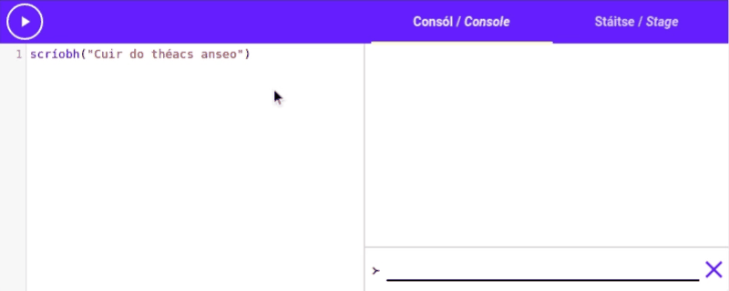

# Is é Ríomhchlárú ná...

Sula dtosóimid ag foghlaim conas *Setanta* a scríobh agus a úsáid, ba chóir dúinn smaoineamh faoin
ceist seo.

> **Cad é ríomhchlárú?**

Inniu tá ríomhairí sár-chliste, is féidir leo [[áirimh|calculations]] a dhéanamh i bhfaiteadh na súl
nach féidir le haon duine a dhéanamh ina cheann. Bíodh sin mar atá, bíonn treoir de dhíth ar
ríomhaire chun áireamh a dhéanamh agus is éard atá i ríomhchlárú ná an treoir sin a thabhairt.

Nuair a scríobhaimid ríomhchláir, scríobhaimid [[treoracha|instructions]] chun go leanfaidh an
ríomhaire iad. Léifidh an ríomhaire ár dtreoracha agus leanfaidh sé iad go díreach.

## Cad é teanga ríomhchlárúcháin?

Is teanga speisialta a thuigeann ríomhairí é teanga ríomhchlárúcháin. Bainimid úsáid as chun ár
dtreoracha a scríobh.

[[Deartar roinnt teangacha ríomhchlárúcháin|Some programming languages are designed]] ionas gur
féidir le daoine iad a thuiscint chomh maith le ríomhairí. Is ceann de na teangacha sin é Setanta,
ach tá sé beagáinín difriúil.

Deartar beagnach gach teanga ríomhchlárúcháin chun a bheith cosúil le Béarla, ach tá *Setanta*
difriúil. Nuair a scríobhaimid cód *Setanta*, tá sé beagnach cosúil le bheith ag scríobh na
dtreoracha as Gaeilge.

## Comhréir

Is ainm galánta é [["Comhréir"|Syntax]] ar na rialacha a shainíonn cad é ríomhchlár bailí. Tá
comhréir ag teangacha labhartha freisin ach glaoimid "gramadach" air. Mar shampla, caithfidh gach
ceist Gaeilge críochnaigh le comhartha ceiste.

Tá rialacha cosúil le sin ag teangacha ríomhchlárúcháin freisin. [[Shainíonn siad|they define]]
an caoi a scríobhann tú ríomhchláir sa teanga.

# Treoracha simplí

Chun tosú ar ríomhchlárú agus *Setanta*, féachaimis anois ar roinnt treoracha simplí.

## Scríobh

Tá gníomh ag *Setanta* ar a dtugtar `scríobh`{.setanta}. Is féidir linn `scríobh`{.setanta} a úsáid
chun téacs a scríobh ar an gconsól. Bainimid úsáid as an gníomh `scríobh`{.setanta} mar seo:

```setanta
scríobh("Do théacs anseo")
```

Is féidir leat aon téacs is mian leat a chuir idir na
[[comharthaí dúbailte athfhriotail|double quotes]] (") agus scríobhfaidh `scríobh`{.setanta} é amach
ar an gconsól. Bain triail as anseo:

{{{
scríobh("Cuir do théacs anseo")
}}}

Athraigh an téacs `"Cuir do théacs anseo"`{.setanta} go rud éigin eile agus rith an cód. Déan
iarracht an cód a athrú chun d'ainm a scríobh! Seo GIF gearr mar shampla:



### Ní féidir liom "í" a scríobh!

Tuigeann *Setanta* go mb'fhéidir nach féidir leat síntí fada (áéíóú) a chlóscríobh, mar sin oibríonn
gach gníomh a thagann le *Setanta* i gceart gan na síntí fada.

Bain triail as `scriobh`{.setanta} (gan fada) a chuir in ionad `scríobh`{.setanta} sá cód thuas agus
feicfidh tú go n-oibríonn sé fós.

### Cad más mian liom comharthaí dúbailte athfhriotail (") a úsáid i mo théacs?

Tá dhá roghanna agat: Is é an céad rogha ná `\"` a scríobh chun na comharthaí athfhriotail a
[["éalú"|escape]] mar seo:

```{.setanta .numberLines}
"Tá \"comharthaí dúbailte athfhriotail\" sa téacs seo"
```

Is é an dara rogha ná [[comharthaí singile athfhriotail|single quotes]] a úsáid chun do théacs a
shainmhíniú, mar seo:

```{.setanta .numberLines}
'Tá "comharthaí dúbailte athfhriotail" sa téacs seo'
```

## Áirimh

Chonaiceamar gur féidir le *Setanta* téacs a scríobh, ach is féidir leis a lán níos mó ná sin amháin
a dhéanamh. Mar shampla: Is féidir le *Setanta* [[áirimh|calculations]] a dhéanamh duit! Rith an cód
seo a leanas agus feicfidh tú go ndéanfaidh *Setanta* an áireamh ar fad. Scríobhfaidh *Setanta*
freagra `28 + 36 * 2`{.setanta} ar an gconsól.

{{{
scríobh("Freagra:", 28 + 36 * 2)
}}}

Is féidir leat luachanna na n-uimhreacha a athrú nó níos mó a chur istigh. Bain triail as
[[slonn|expression]] mata eile a chur isteach in ionad `28 + 36 * 2`{.setanta}. Is féidir leat gach
siombail atá a fhios agat cheana a úsáid. Mar shampla:

> `+` le haghaidh [[suimiú|addition]], `-` le haghaidh [[dealú|subtraction]], `*` le haghaidh
> [[iolrú|multiplication]] agus `/` le haghaidh [[roinnt|division]].

Is féidir leat [[lúibíní|brackets]] a úsáid chun sloinn casta a chruthú. Déan iarracht freagraí na
sloinn seo a scríobh ar an gconsól le `scríobh`{.setanta} san eagarthóir thuas:

```setanta
1 + 2 * (3 - 4) / 5
1 + 2 - (3 + (4 - 5))
```

Chomh maith, is féidir leat uimhreacha le [[pointe deachúlach|decimal point]] a úsáid. Mar shampla
`1.2`{.setanta} nó `123.4`{.setanta}.

## Ag cur téacs le chéile.

Is féidir linn an [[oibritheoir|operator]] `+` a úsáid le téacs freisin chun dhá phíosa téacs a chur
le chéile. Bain triail as:

{{{
scríobh("Dia" + " Duit")
}}}

## Tráchtanna

Uaireanta ba mhaith linn rudaí a scríobh inár ríomhchláir nach mhaith linn go ndéanfaidh an
ríomhaire iarracht iad a thuiscint. Go minic is nótaí beaga iad, nó mínithe ar cad a
dhéanann rud éigin.

Ar an dea-uair, is féidir linn é seo a dhéanamh. Dá scríobhfadh muid `>--`{.setanta} in aon áit sa
ríomhchlár, [[thabharfadh an ríomhaire neamhaird|the computer would ignore]] ar aon rud a
scríobhfadh muid ina dhiaidh ar an líne céanna. Tugaimid [[**"tráchtanna"**|comments]] ar na píosa
cód sin. Seo sampla:

{{{
scríobh("Scríobh mé")
>-- Tabharfaidh an ríomhaire neamhaird ar seo :o
}}}

Ní thugann an ríomhaire aird ach ar an gcéad líne. Tugann sé neamhaird ar an dara cheann mar
tosaíonn sé le `>--`{.setanta}.

De ghnáth, téann tráchtanna go dtí deireadh an líne, ach is féidir linn trácht a chríochnaigh go
luath más maith linn. Caithfidh muid `--<`{.setanta} a chur isteach san áit ar mhaith linn deireadh
a chur leis an trácht.

Tugaimid [[**"tráchtanna inlíne"**|inline comments]] ar na tráchtanna sin.

```{.setanta .numberLines}
scríobh(1 + >-- Trácht inlíne --< 2)
```

# Ag Meascadh

Nuair atá an an ríomhaire ag leanadh na treoracha i ríomhchlár *Setanta* tosaíonn sé ag an mbarr,
agus ansin leanann sé ag dul síos an liosta. Mar gheall ar sin, más mian linn treoir a dhéanamh tar
éis treoir eile, níl le déanamh againn ach é a scríobh ar an céad líne eile. Féach anois ar an cód
seo:

{{{
scríobh("Roimh chodladh")
codladh(2000)
scríobh("Tar éis an chodlata")
}}}

Má ritheann tú an cód seo, ar dtús scríobhfaidh sé `"Roimh chodladh"`, ansin fanfaidh sé ar feadh 2
soicind, faoi dheireadh scríobhfaidh sé `"Tar éis an chodlata"`. Déanfaidh an ríomhchlár é sin mar
d'úsáideamar an gníomh [[`codladh`{.setanta}|sleep]]. Bainimid úsáid as `codladh`{.setanta} nuair ba
mhaith linn go codlaíonn an ríomhaire sula leanann sé ar aghaidh go dtí an chéad treoir eile.

Glacann an gníomh `codladh`{.setanta} le méid [[milleasoicind|millisecond]] (2000 sa chás seo), agus
nuair a sroicheann an ríomhaire an treoir sin, fanfaidh sé ar feadh an méid sin sula leanann sé ar
aghaidh.

Seo iad ná céimeanna a leanann an ríomhaire:

1. Léigh an céad líne "`scríobh("Roimh chodladh")`{.setanta}" agus scríobh
   `"Roimh chodladh"`{.setanta} ar an gconsól.
2. Lean ar aghaidh go dtí an dara líne "`codladh(2000)`{.setanta}". Fan anseo ar feadh 2000
   milleasoicindí (2 soicindí).
3. Léigh an tríú líne "`scríobh("Tar éis an chodlata")`{.setanta}" agus scríobh
   `"Tar éis an chodlata"`{.setanta} ar an gconsól.
4. Críochnaigh.

# Athróga

Is ceann de na [[cumas|ability]] is tábhachtaí atá ag ríomhairí ná [[cuimhne|memory]]. Nuair a
scríobhaimid ríomhchlár is féidir linn [[iarr|ask]] ar an ríomhaire luachanna áirithe a chuimhnigh.
Níos déanaí sa ríomhchlár is féidir linn iarr ar an ríomhaire chun iad a chuimhnigh ar.

Chun é sin a dhéanamh, bainimid úsáid as [[**athróga**|variables]].

Tá athróg cosúil le bosca is féidir linn luach a chuir isteach. Tugaimid ainm ar an bosca agus
úsáidimid an ainm sin chun an luach a úsáid nó athrú inár ríomhchlár.

## Ag cruthú athróga

Chun athróg nua a chruthú bainimid úsáid as an siombail `:=`{.setanta}. Mar shampla:

```{.setanta .numberLines}
bia := "sceallóga"
```

Cruthaíonn an cód sin athróg nua "`bia`", agus cuireann sé an luach `"sceallóga"`{.setanta} istigh
ann. Anois dá ghlaofadh muid `scríobh(bia)`{.setanta}, chuimhneodh an ríomhaire go d'iarramar air
chun "sceallóga" a stóráil san athróg `bia`, agus scríobhfadh sé "sceallóga" ar an gconsól.

Bain triail as anois!

{{{
bia := "sceallóga"
scríobh(bia)
}}}

### Míniú

1. Cruthaíonn an céad líne an athróg `bia`, leis an luach `"sceallóga"`{.setanta}.
2. Ar an dara líne, chuimhníonn an ríomhaire go bhfuil `"sceallóga"`{.setanta} stóráilte san athróg
   `bia`, agus baineann sé úsáid as an luach sin chun "sceallóga" a scríobh ar an gconsól.

## Ag uasdátaigh athróga

Nuair a chruthaíonn tú athróg, níl an luach san athróg [[socraithe|fixed]] go deo. Is féidir leat
luach na hathróige a athrú in áit ar bith i do ríomhchlár. Chun luach na hathróige a athrú, bainimid
úsáid as sín chothroime (`=`). Tá an siombail seo difriúil leis an siombail `:=` a úsáidtear chun
athróg nua a chruthú.

Bain triail as an ríomhchlár seo:

{{{
>-- Cruthaigh athróg nua "ainm" leis an luach "Setanta"
ainm := "Setanta"
scríobh(ainm)
>-- Athraigh luach "ainm" go "Cú Chulainn"
ainm = "Cú Chulainn"
scríobh(ainm)
}}}

Tabhair faoi deara nuair an chead uair a scríobhamar `ainm` scríobhadh `"Setanta"`{.setanta}, ach an
dara uair a scríobhamar `ainm`, scríobhadh `"Cú Chulainn"`{.setanta}. Athraíodh an téacs mar
d'athraíomar luach na hathróige ar an 5ú líne.

Nuair a ritheann an ríomhaire [[ráiteas uasdátaigh athróige|variable update statement]] mar seo,
ríomhann sé an slonn tar éis an [[sín chothroime|equals sign]] ar dtús sula athraíonn sé luach na
hathróige. De bhrí sin, is féidir linn [[luach reatha|current value]] na hathróige a úsáid chun an
luach nua a ríomh. Féach anois ar an cód seo:

{{{
x := 2
x = x + 10
scríobh(x)
}}}

Nuair a rithimid an cód sin, scríobhann sé `12`{.setanta} ar an gconsól. Cén fáth?

### Míniú

1. Cruthaíonn an chéad líne athróg nua `x` leis an luach `2`{.setanta}.
2. Ar an dara líne, tosaíonn an ríomhaire ag athrú luach `x`. Chun an luach nua a fháil, ríomhann sé
   luach an tsloinn `x + 10`{.setanta}. Is é `12`{.setanta} freagra an áireamh sin mar is é
   `2`{.setanta} luach `x` [[faoi láthair|at the moment]].
3. Ansin, athraíonn an ríomhaire luach `x` go `12`{.setanta}.
4. Ar an tríú líne, scríobhann an ríomhaire luach `x` ar an gconsól, agus anois is é `12`{.setanta}
   luach `x`.


## Dúshlán

Athraigh an cód sa ríomhchlár seo ionas go scríobhann sé `"bainne"`{.setanta} ar an gconsól:

{{{
bia := "sceallóga"
scríobh(bia)
}}}

[[Cliceáil anseo le haghaidh an freagra|Athraigh an céad líne go bia := &quot;bainne&quot;]]

# Cad a dhéanfaimid anois?

Chonaiceamar roinnt treoracha simplí chun an consól a úsáid, tuigimid anois conas treoir éigin a
dhéanamh tar éis treoir eile agus d'fhoghlaimíomar conas athróga a úsáid chun luachanna a
chuimhnigh. Anois is féidir linn ár scileanna nua a thógáil go dtí an stáitse!
