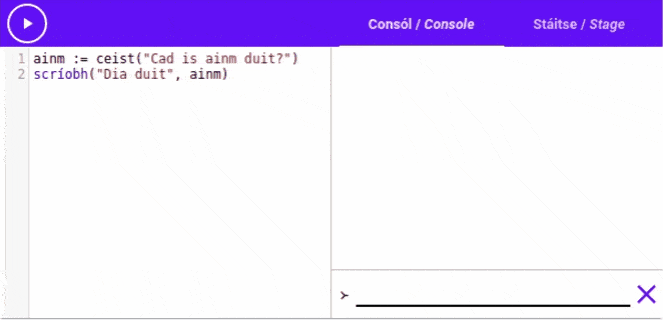

# Fáilte!

**_Fáilte go dtí Teagasc Setanta_**.

Tá súil againn go bhfuil tú réidh chun gach rud faoi [[ríomhchlárú|programming]] a fhoghlaim, agus
conas a oibríonn Gaeilge leis.

Níl ach cúpla rudaí le míniú sula mbeidh tú réidh le tosú.

## Aistriúcháin

Má fheiceann tú focal le folíne mar [[seo|D'aimsigh tú mé!]], is focal é le
[[haistriúchán|translation]].  Cuir do luch thar an focal nó cliceáil air chun an t-aistriúchán a
fheiceáil. [[Bain triail as!|Try it out!]]

## Eagarthóirí Setanta

Ar fud an [[teagaisc|tutorial]] seo, aimseoidh tú [[eagarthóirí|editors]] Setanta mar seo:

{{{
>-- Is eagarthóir Setanta é seo
scríobh("Dia duit!")
}}}

Is féidir linn eagarthóirí a úsáid chun ríomhchláir Setanta a scríobh. Clóscríobhaimid ríomhchlár
sa bosca ar chlé agus brúimid <iron-icon class="play" icon="av:play-arrow"></iron-icon> chun
é a thosú. Beidh torthaí an ríomhchláir le feiceáil ar dheis.

Brúigh an cnaipe <iron-icon class="play" icon="av:play-arrow"></iron-icon> chun an cód san
eagarthóir a rith.  Bá chóir go mbeadh "Dia duit!" scríofa ar an taobh dheis.

## An Consól

Ar an taobh dheis, ba chóir go mbeadh seo le feiceáil:

> Dia Duit!

Is é seo an consól. Is féidir linn an consól a úsáid chun [[teachtaireachtaí|messages]] a léamh agus
a scríobh.  Sa ríomhchlár roimhe (`scríobh("Dia duit!")`{.setanta}), d'úsáideamar an
[[gníomh|action]] `scríobh`{.setanta} chun "Dia duit!" a scríobh amach ar an gconsól.

Freisin, is féidir linn an consól a úsáid chun teachtaireachtaí a sheoladh chuig an ríomhchlár. Bain
triail as an gcéad ríomhchlár eile seo a rith; Ba chóir go scríobhfadh sé "Cad is ainm duit?" sa
chonsól. Clóscríobh d'ainm isteach sá bosca téacs ag an bun agus brúigh an
[[eochair iontrála|enter key]].

{{{
ainm := ceist("Cad is ainm duit?")
scríobh("Dia duit", ainm)
}}}

Brúigh an <iron-icon class="clear" icon="icons:clear"></iron-icon> chun an consól a ghlanadh.

### Taispeántas

## An Stáitse

Tá dhá táib i ngach eagarthóir, agus is féidir leat athrú eatarthu. Taispeánann ceann amháin an
consól, agus taispeánann ceann eile an stáitse.

Is féidir linn an stáitse a úsáid le Setanta chun pictiúir nó [[beochaintí|animations]] a tharraingt,
agus fiú cluichí a chruthú!

Rith an ríomhchlár a leanas, agus ansin cliceáil ar an táb "Stáitse/Stage" chun an stáitse a
fheiceáil.

{{{
dath@stáitse("dearg")
ciorcal@stáitse(200, 200, 100)
}}}

Ba chóir go mbeadh ciorcal dearg le fheiceáil.

<!-- TODO(#11) Support try-setanta.ie/eagarthoir --> # try-setanta.ie/editor

Is leaganacha beaga den [[phríomh-eagarthóir|main editor]] ar try-setanta.ie iad na heagarthóirí
atáimid ag úsáid sa teagasc seo. Más mhaith leat triail a bhaint as do chód ar scáileán níos mó, nó
do chód a shábháil agus a roinnt le daoine eile, ba chóir duit dul go
[try-setanta.ie/editor](https://try-setanta.ie/editor) agus triail a bhaint as an príomh-eagarthóir.

# Tosaímis!

Anois tá a fhios agat conas na heagarthóirí agus na haistriúcháin a úsáid, is féidir linn tosú ag
foghlaim Setanta. Bog go dtí an céad roinn eile leis an cnaipe "Céad leathanach eile" sa painéal
"Clár", nó leis an cnaipe ag bun an leathanaigh.
