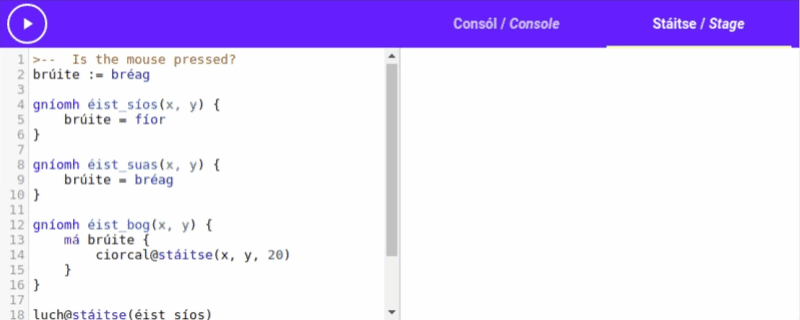

# Mouse Events

*Setanta* doesn't just limit you to using the keyboard for your programs, you can use the
[[mouse|luch]] too! Let's use the *Setanta* mouse events to make a program that lets us draw on the
stage with our mouse.


## The Events

There are three different types of mouse events we can listen for: Mouse down, Mouse move
and mouse up.

- **Mouse down**: Mouse down events are triggered when the mouse click is pressed on the stage.
- **Mouse move**: Mouse move events are triggered when the mouse is moved over the stage.
- **Mouse up**: Mouse up events are triggered when the mouse click is released.

*Setanta* provides 3 different actions that we can use to listen for these events. Just like the
`méarchlár@stáitse` action let us listen for keyboard presses.

## The Strategy

To make our drawing program, we will keep track of when the mouse is clicked, but hasn't been
released yet. Then when the mouse is moved we will draw on the stage.

# Listeners

Let's make our listener actions. We'll call these `éist_síos`, `éist_suas` and `éist_bog`. "Éist"
translates as "listen", "síos" means down, "suas" means up, and "bog" means move, so `éist_síos`
will be our action for mouse down events, `éist_suas` will be our action for mouse up events, and
`éist_bog` will be our action for mouse move events.

Each of these listener actions should take two arguments, `x` and `y`. These are the `x` and `y`
positions that the event happened at.

```{.setanta .numberLines}
gníomh éist_síos(x, y) {
    >-- Code to execute when the mouse is pressed
}

gníomh éist_suas(x, y) {
    >-- Code to execute when the mouse is released
}

gníomh éist_bog(x, y) {
    >-- Code to execute when the mouse is moved
}
```

The actions that actually tell *Setanta* to use actions with the mouse events are called
`luch@stáitse`{.setanta} for the mouse down event, `luch_suas@stáitse`{.setanta} for the mouse up event and
`luch_bog@stáitse`{.setanta} for the mouse move event.

We call these actions and pass them our listener actions to make _Setanta_ call them when the mouse
events happen.

```{.setanta .numberLines}
gníomh éist_síos(x, y) {
    >-- Code to execute when the mouse is pressed
}

gníomh éist_suas(x, y) {
    >-- Code to execute when the mouse is released
}

gníomh éist_bog(x, y) {
    >-- Code to execute when the mouse is moved
}

>-- Use our `éist` actions for mouse events.
luch@stáitse(éist_síos)
luch_suas@stáitse(éist_suas)
luch_bog@stáitse(éist_bog)
```

## Let's Test

Let's add some code to the `éist_síos` action to draw a circle on the stage
console when the mouse is pressed. We are given the `x` and `y` positions when `éist_síos` is
called, so we can use them as the center of the circle.

{{{s
gníomh éist_síos(x, y) {
    ciorcal@stáitse(x, y, 10)
}

gníomh éist_suas(x, y) {
    >-- Code to execute when the mouse is released
}

gníomh éist_bog(x, y) {
    >-- Code to execute when the mouse is moved
}

>-- Use our `éist` actions for mouse events.
luch@stáitse(éist_síos)
luch_suas@stáitse(éist_suas)
luch_bog@stáitse(éist_bog)
}}}


**Oh no! Nothing happened? Why?**

## What went wrong?

If you look carefully at the <iron-icon class="play" icon="av:play-arrow"></iron-icon> button you'll
see why. It never changes to a <iron-icon class="play" icon="av:stop"></iron-icon> button. This is
because the program starts and finishes almost immediately. It made our new actions, told *Setanta* to use them when the mouse
is pressed, but then it finished, so the program was stopped. _We didn't get time to click on the
stage_.

## The Fix

We need to stop the *Setanta* program from finishing until we press the <iron-icon class="play" icon="av:stop"></iron-icon> button.
We can use the "`fán`{.setanta}" (meaning "wait") action to do this. When you call `fán()`{.setanta}, *Setanta* will
stop and wait. It's like calling `codladh`{.setanta} to sleep for an infinite time. If we add a call to
`fán`{.setanta}
at the end of our program it will work now!

{{{s
gníomh éist_síos(x, y) {
    ciorcal@stáitse(x, y, 10)
}

gníomh éist_suas(x, y) {
    >-- Code to execute when the mouse is released
}

gníomh éist_bog(x, y) {
    >-- Code to execute when the mouse is moved
}

>-- Use our `éist` actions for mouse events.
luch@stáitse(éist_síos)
luch_suas@stáitse(éist_suas)
luch_bog@stáitse(éist_bog)
fán()
}}}

**Now it works!**

# Is it pressed?

Now it's time to think about tracking whether the mouse is pressed or not. Let's add a variable at the top of the program called "`brúite`" (which means "pressed"), this variable will store whether the
mouse is currently pressed down or not.

When the mouse is clicked down, we should make this value true (`fíor`{.setanta}), and when it's
released we should change it to false (`bréag`{.setanta}).

The `éist_síos` action will be called when the mouse is clicked, so we should make `brúite` true in
there. The `éist_suas` action will be called when the mouse is release, so we should make `brúite`
false in that action.

```{.setanta .numberLines}
>--  Is the mouse pressed?
brúite := bréag

gníomh éist_síos(x, y) {
    brúite = fíor
}

gníomh éist_suas(x, y) {
    brúite = bréag
}

gníomh éist_bog(x, y) {
    >-- Code to execute when the mouse is moved
}

>-- Use our `éist` actions for mouse events.
luch@stáitse(éist_síos)
luch_suas@stáitse(éist_suas)
luch_bog@stáitse(éist_bog)
fán()
```

Let's add logic to `éist_bog` to draw a circle when the mouse is moved if the mouse is being pressed
so we can see that it all works. We should check if `brúite` is `fíor`{.setanta}, and if it is use `ciorcal@stáitse(x, y, 20)`{.setanta} to draw a circle.
the action. **The `x` and `y` coordinates given to** **`éist_bog`** **will be the position the mouse has
moved to**.

The new `éist_bog` action looks like:
```{.setanta .numberLines}
gníomh éist_bog(x, y) {
    má brúite {
        ciorcal@stáitse(x, y, 20)
    }
}
```

Try it out! Run the program then click and drag your mouse across the stage.

{{{s
>--  Is the mouse pressed?
brúite := bréag

gníomh éist_síos(x, y) {
    brúite = fíor
}

gníomh éist_suas(x, y) {
    brúite = bréag
}

gníomh éist_bog(x, y) {
    má brúite {
        ciorcal@stáitse(x, y, 20)
    }
}

>-- Use our `éist` actions for mouse events.
luch@stáitse(éist_síos)
luch_suas@stáitse(éist_suas)
luch_bog@stáitse(éist_bog)
fán()
}}}



# Lines

The circles is a cool effect! But it's not what we're looking for. The last step is to make it draw
lines when the mouse is moved.

When the mouse move event is triggered, we are given the new position of the mouse, we need to keep
track of the old position ourselves. We can do this with 2 variables, `x_roimhe` and `y_roimhe`.
These are short for "`x` roimhe seo" and "`y` roimhe seo", which means "previous x" and "previous
y".

We add `x_roimhe := 0`{.setanta} and `y_roimhe := 0`{.setanta} to the top of the program. (_The
initial values can be anything we like, they'll be updated straight away`)_.

Now the start of our program looks like:

```{.setanta .numberLines}
>-- Track previous x and y positions
x_roimhe := 0
y_roimhe := 0

>--  Is the mouse pressed?
brúite := bréag
```

Every time the mouse moves (and is pressed) we draw a line from the old position to the new position,
then update the variables to the new position. We can draw a line using the `líne@stáitse`{.setanta}
action. "`líne`" translates as "line". `líne@stáitse`{.setanta} takes 4 arguments: `x1`, `y1`, `x2`
and `y2`. It then draws a line from (`x1`, `y1`) to (`x2`, `y2`).

Now we change our `éist_bog` action to draw the line from (`x_roimhe`, `y_roimhe`) to (`x`, `y`),
and then update `x_roimhe` and `y_roimhe`. The new `éist_bog` action looks like this:

```{.setanta .numberLines}
gníomh éist_bog(x, y) {
    má brúite {
        líne@stáitse(x_roimhe, y_roimhe, x, y)
    }
    x_roimhe = x
    y_roimhe = y
}
```

Check it out!

{{{s
>-- Track previous x and y positions
x_roimhe := 0
y_roimhe := 0

>--  Is the mouse pressed?
brúite := bréag

gníomh éist_síos(x, y) {
    brúite = fíor
}

gníomh éist_suas(x, y) {
    brúite = bréag
}

gníomh éist_bog(x, y) {
    má brúite {
        líne@stáitse(x_roimhe, y_roimhe, x, y)
    }
    x_roimhe = x
    y_roimhe = y
}

>-- Use our `éist` actions for mouse events.
luch@stáitse(éist_síos)
luch_suas@stáitse(éist_suas)
luch_bog@stáitse(éist_bog)
fán()
}}}
