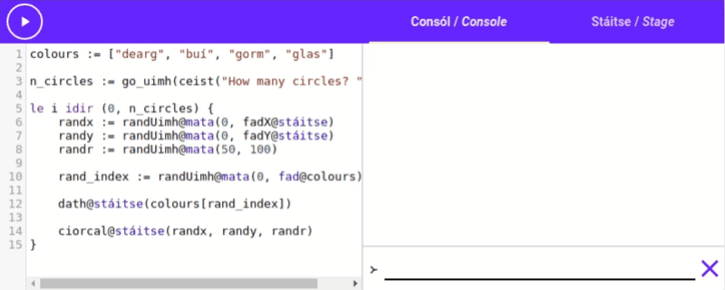

# Lists

So far in *Setanta* we've only been using text and numbers in our programs. These have allowed us to do some powerful stuff, but they are also very limiting.

What if we want to deal with more than one piece of text, or more than one number. That's where **[[lists|liostaí]]** come in. Lists, unsurprisingly, allow us to [[store|stóráil]] values in a [[list|liosta]].

## How to make a list

Lists are created with [[square brackets|lúibíní cearnach]] (`[, ]`) around the outside and commas (`,`) to [[separate|scar]] the [[elements|baill]] of the list, for example: `[100, 200, 300]`{.setanta} is a list with 3 elements. 100 is the first element, 200 is the second, and 300 is the last element. `[]` is an empty list.

Try adding `4` as a fourth element to the list `[1, 2, 3]`{.setanta} here:

{{{
scríobh([1, 2, 3])
}}}

[[Click here to see the answer.|scríobh([1, 2, 3, 4])]]

In that example [[we saw|chonaiceamar]] a list of numbers, but you can make a list out of whatever you like! Text, numbers, booleans, other lists, you name it. You can even mix and match in the same list.

```{.setanta .numberLines}
[1, 2, 3] >-- Numbers
["Hello", "Goodbye"] >-- Text
[["List", "inside"], ["a", "list"]] >-- Lists of lists
[10, fíor, "Dia duit"] >-- Mix up the types
```

## Joining lists

Lists can be [[joined together|ceangailte le chéile]] with the "`+`" operator, just like text and numbers.

{{{
scríobh([10, 20] + [30, 40])
}}}

Using `+` with two lists creates a [[new list|liosta nua]] made up of the 2 original lists joined together.

We can use this to add elements to the [[end|deireadh]] or [[front|tosach]] of existing lists.

{{{
x := [1, 2, 3]
x = x + [4]
scríobh(x)
}}}

### Explanation:

- On the first line, [[we create|cruthaímid]] a new list `[1, 2, 3]`{.setanta}, and put it in the new variable "`x`".
- On the second line we [[update|nuashonraigh]] the variable `x` with the value `x + [4]`{.setanta}. The value stored in `x` is `[1, 2, 3]`{.setanta}, so this evaluates to `[1, 2, 3] + [4]`{.setanta} which equals `[1, 2, 3, 4]`{.setanta}. We then update the variable `x` to this value.
- On the third line we print `x`, which is now `[1, 2, 3, 4]`{.setanta}.

## Access

Now that we know how to make lists, and how to put values into the lists, how do we get values back out?

The [[elements of a list|baill liosta]] are [[numbered|uimhrithe]]. The first element of the list is element 0, the second is element 1, then 2, then 3, etc. This number is called the [[**index**|innéacs]] of the element.


We use square brackets (`[]`) again to access an element at a specific index. We wrap the index in square brackets and place it [[after|tar éis]] the list. e.g. if we have a list called `our_list`, we can access the first element by writing `our_list[0]`{.setanta}, the second element by writing `our_list[1]`{.setanta}, and so on. Here's an example you can play with:

{{{
>-- Make a new list
list := [10, 20, 30, 40]

>-- Access index 0 (the first element)
first := list[0]

scríobh(first)
}}}

Try changing the `0`{.setanta} on line 5 to a different number and see what happens.

### Out of bounds

Our list `[10, 20, 30, 40]`{.setanta} in the last example is only 4 elements [[long|ar fad]], so what happens if we try and get access to the 5th element (index 4)? Try it out:

{{{
[10, 20, 30, 40][4]
}}}

You should get an [[error|earráid]] saying "[[Tá 4 thar teorainn an liosta|4 is outside the limits of the list]]" which translates as "4 is outside the limits of the list".


If a list has some [[length|fad]] L, then the only valid indices are 0, 1, 2 ... up to L - 1.

## Length

We often want to know [[how many|cé mhéad]] elements are in a list. To do this we can use the word "[[fad|length]]" meaning "length". If our list is called `our_list`, we write `fad@our_list`{.setanta} to get the length. Try it out!:

{{{
scríobh(fad@[1, 2, 3])
}}}

*([[We will see|feicfimid]] what the "@" symbol does in the future)*

This can be very useful if we want to get the [[*last* element|ball deireanach]] of the list. Remember that this will be at index `fad@our_list - 1`. Try it out here:

{{{
>-- Create a new list called "x"
x := ["Setanta", "is", "fun"]
>-- Access the last element (index fad@x - 1)
scríobh(x[fad@x - 1])
}}}

# Loop-de-loop

Now that we have our lists, what can we do with them. The main tool that we will use with lists are called "[[loops|lúba]]".

Loops give us a way of taking some piece of code and repeating it over and over. We'll take a look at [[types|cineálacha]] of loops, and then see how we can use them with lists.

## Le idir

Our first type of loop we're going to look at is called the "[[le|with]] [[idir|between]]" loop. "le idir" translates as "with between". This loop is called "with between" because it allows us to loop **with** some variable, **between** two values.

The syntax for a "le idir" loop is:

```{.setanta .numberLines}
le <variable> idir (<start>, <finish>) {
    <code to repeat>
}
```

How a "le idir" loop works is:

1. The *Setanta* interpreter creates a new variable, with the name we gave ("\<variable\>"). This is called the **loop variable**.
2. Then it assigns this variable the "\<start\>" value.
3. It runs the code between the curly braces (`{ }`).
4. It then [[increases|méadaíonn]] the value in the loop variable.
5. It checks if the loop variable is equal to the "\<finish\>" variable. If it is, [[it exits|scoireann sé]] the "le idir" loop and [[continues|leanann]] on after.
6. If the loop variable wasn't equal to the finish value, then it [[returns|filleann]] to step 3.

This might be a little confusing to read, but it's easy to see with an example. Let's run the following code:

## Example

{{{
le i idir (0, 5) {
    scríobh(i)
}
scríobh("Finished")
}}}

Running this code you should see that it writes "0", then "1", then "2", "3", and "4". It then writes "[[Finished|Críochnaithe]]".

### Explanation

To execute the "le idir" loop, *Setanta* creates a new variable called "`i`". We could choose any name for this variable, but in our example we chose "`i`".

*Setanta* first assigns the start value (in our case `0`{.setanta}) to `i`, and then runs the code in the curly braces. This code is `scríobh(i)`{.setanta}. So the first thing that gets written is "0".

Next *Setanta* increases the value of `i`, so now `i` contains the value `1`{.setanta}. It then checks, is `i` equal to the finish value (in our case `5`{.setanta})? It isn't, so it returns to step 3 and runs the code [[inside the brackets|taobh istigh de na lúibíní]].
Again this is `scríobh(i)`{.setanta}. Now however `i` is `1`{.setanta}, so "1" is written on the console.

This continues for 2, 3 and 4.

Finally after *Setanta* runs the code for `4`{.setanta} it increases the value of `i` to `5`{.setanta}. Now however it checks if `i` is equal to the finish value, and this time it is. This tells *Setanta* that we are finished, so it exits the loop and continues on to the next statement.

The next statement is `scríobh("Finished")`{.setanta}, so it writes "Finished" on the console. This is the last statement so the program finishes.

## List print

Now that we can use *le idir* loops, we can use them to loop over each element of a list with ease. Try this code out:

{{{
my_list := [1, 2, 3, 4, 5]
le i idir (0, fad@my_list) {
    scríobh(my_list[i])
}
}}}

This code prints out every element of a list. It does this by using a *le idir* loop from 0 up to the length of the list, using the loop variable to access the list elements and using `scríobh`{.setanta} to write them on the console.

## List sum

Let's explore how we could [[add up|suimigh]] all the elements of a list of numbers. We should start with our code from before to loop over all the element of the list

```{.setanta .numberLines}
>-- Start with some list
my_list := [11, 12, 13, 14, 15]

>-- Use le idir loop to loop over the elements
le i idir (0, fad@my_list) {
}
```

Now we can make a new variable to store the [[sum|suim]] of the elements. This variable starts out with the value 0.

```{.setanta .numberLines}
>-- Start with some list
my_list := [11, 12, 13, 14, 15]

>-- A variable to store the sum of the elements.
sum := 0

>-- Use le idir loop to loop over the elements
le i idir (0, fad@my_list) {
}
```

Then for each element of the list we can add it's value to the sum with `sum = sum + my_list[i]`{.setanta}

```{.setanta .numberLines}
>-- Start with some list
my_list := [11, 12, 13, 14, 15]

>-- A variable to store the sum of the elements.
sum := 0

>-- Use le idir loop to loop over the elements
le i idir (0, fad@my_list) {
    sum = sum + my_list[i]
}
```

Now we just add our final line `scríobh(sum)`{.setanta} to write the sum of the list on the console. Try out the final code!

{{{
>-- Start with some list
my_list := [11, 12, 13, 14, 15]

>-- A variable to store the sum of the elements.
sum := 0

>-- Use le idir loop to loop over the elements
le i idir (0, fad@my_list) {
    sum = sum + my_list[i]
}

scríobh(sum)
}}}

### Bonus shorthand

We used `sum = sum + my_list[i]` to add `my_list[i]` to the sum variable. *Setanta* has a shorthand for this common problem, the `+=` operator. We can just write `sum += my_list[i]` to add `my_list[i]` to the sum.

There is also `*=`, `-=` and `/=` for [[multiplication|iolrú]], [[subtraction|dealú]] and [[division|roinnt]] respectively.

# Circle Art

Let's combine what we've seen before with our [[new knowledge|eolas nua]] and make some [[art|ealaín]]. Let's make a program where the user can input a number of circles that they would like, and the program will [[randomly|go randamach]] [[draw|tarraing]] that many circles all over the stage, with random [[positions|áiteanna]] and [[sizes|méideanna]].

There are a few new actions and values we'll have to look at before we start.

## Random

First lets see how do we generate a random number? Lucky for us *Setanta* has 2 actions that can do that for us, `rand` and `randUimhir`. These are maths functions so we access them with `rand@mata`{.setanta} and `randUimh@mata`{.setanta}. (Once again, we'll see what the @ does in the future).

- `rand` returns a random number between 0 and 1, not necessarily a [[whole number|slánuimhir]] e.g. 0.5, 0.333 etc.
- `randUimh` takes two arguments and returns a random whole number between those 2. e.g. `randUimh(3, 6)`{.setanta} will return one of 3, 4 or 5 with equal [[probability|dóchúlacht]] (it doesn't include the upper bound).

Try out this code a few times:

{{{
scríobh(randUimh@mata(0, 100))
}}}

You should get different numbers from 0 to 99 each time.

## The Stage

If we want to place circles randomly on the stage, we'll need to know how big it is.

We can access the width and height by accessing the values `fadX@stáitse`{.setanta} and `fadY@stáitse`{.setanta}.

Try running this code:

{{{
scríobh("X length", fadX@stáitse)
scríobh("Y length", fadY@stáitse)
}}}

If you resize your window you might get different results.

## The Art

Ok let's write our program: First we want to ask the user how many circles they want. [[Remember|Cuimhnigh]] we can use `ceist` to ask for user input, and `go_uimh` to convert text to numbers.

```{.setanta .numberLines}
n_circles := go_uimh(ceist("How many circles? "))
```

Now we would like to create that many circles, so we would like to repeat some code `n_circles` times. We can use a *le idir* loop for this

```{.setanta .numberLines}
n_circles := go_uimh(ceist("How many circles? "))

le i idir (0, n_circles) {
    >-- We'll put our circle logic here
}
```

(*We've named our loop variable `i`, but we won't be using it in the loop*)

To draw a circle randomly, we want to pick a random X coordinate, a random Y coordinate, and a random radius. We can uses `fadX` and `fadY` to get the [[bounds|teorainn]] of the stage, and `randUimh` to generate a random number in that range by using `randUimh@mata(0, fadX@stáitse)`{.setanta} and `randUimh@mata(0, fadY@stáitse)`{.setanta}

```{.setanta .numberLines}
n_circles := go_uimh(ceist("How many circles? "))

le i idir (0, n_circles) {
    randx := randUimh@mata(0, fadX@stáitse)
    randy := randUimh@mata(0, fadY@stáitse)
}
```

We'll just use 50 to 100 as a range for our radius, as we don't want them [[too big|ró mhór]] or [[too small|ró bheag]].

```{.setanta .numberLines}
n_circles := go_uimh(ceist("How many circles? "))

le i idir (0, n_circles) {
    randx := randUimh@mata(0, fadX@stáitse)
    randy := randUimh@mata(0, fadY@stáitse)
    randr := randUimh@mata(50, 100)
}
```

Now that we've picked random coordinates and size, all that's left is to draw the circles using `ciorcal@stáitse`.

```{.setanta .numberLines}
n_circles := go_uimh(ceist("How many circles? "))

le i idir (0, n_circles) {
    randx := randUimh@mata(0, fadX@stáitse)
    randy := randUimh@mata(0, fadY@stáitse)
    randr := randUimh@mata(50, 100)
    ciorcal@stáitse(randx, randy, randr)
}
```

Try running the code! You'll have to type in how many circles you want, then switch tabs to the stage to see the results.

{{{
n_circles := go_uimh(ceist("How many circles? "))

le i idir (0, n_circles) {
    randx := randUimh@mata(0, fadX@stáitse)
    randy := randUimh@mata(0, fadY@stáitse)
    randr := randUimh@mata(50, 100)
    ciorcal@stáitse(randx, randy, randr)
}
}}}

### Switch up the colours

It's a bit boring having all the circles be the same colour. Lets switch it up using lists!

Let's make a list of colours we'd like to see and put it at the top of the program.

```{.setanta .numberLines}
colours := ["dearg", "buí", "gorm", "glas"]

n_circles := go_uimh(ceist("How many circles? "))

le i idir (0, n_circles) {
    randx := randUimh@mata(0, fadX@stáitse)
    randy := randUimh@mata(0, fadY@stáitse)
    randr := randUimh@mata(50, 100)
    ciorcal@stáitse(randx, randy, randr)
}
```

I chose "dearg", "buí", "gorm" and "glas". Now when before we draw a circle, we can switch to a random colour from our list.

To pick a random colour we want to pick a random element from the list. We can do this by picking a random index using `randUimh` and the length of the list (`fad`). This gives us `index := randUimh@mata(0, fad@colours)`{.setanta}.

```{.setanta .numberLines}
colours := ["dearg", "buí", "gorm", "glas"]

n_circles := go_uimh(ceist("How many circles? "))

le i idir (0, n_circles) {
    randx := randUimh@mata(0, fadX@stáitse)
    randy := randUimh@mata(0, fadY@stáitse)
    randr := randUimh@mata(50, 100)

    rand_index := randUimh@mata(0, fad@colours)

    ciorcal@stáitse(randx, randy, randr)
}
```

We can use the index now to pick our random colour "`colours[rand_index]`" and use `dath@stáitse`{.setanta} to switch to that colour:

```{.setanta .numberLines}
colours := ["dearg", "buí", "gorm", "glas"]

n_circles := go_uimh(ceist("How many circles? "))

le i idir (0, n_circles) {
    randx := randUimh@mata(0, fadX@stáitse)
    randy := randUimh@mata(0, fadY@stáitse)
    randr := randUimh@mata(50, 100)

    rand_index := randUimh@mata(0, fad@colours)

    dath@stáitse(colours[rand_index])

    ciorcal@stáitse(randx, randy, randr)
}
```

Now try running the code!

{{{
colours := ["dearg", "buí", "gorm", "glas"]

n_circles := go_uimh(ceist("How many circles? "))

le i idir (0, n_circles) {
    randx := randUimh@mata(0, fadX@stáitse)
    randy := randUimh@mata(0, fadY@stáitse)
    randr := randUimh@mata(50, 100)

    rand_index := randUimh@mata(0, fad@colours)

    dath@stáitse(colours[rand_index])

    ciorcal@stáitse(randx, randy, randr)
}
}}}

### Demo



### Challenge

Switch to using `ciorcalLán@stáitse`{.setanta} instead of `ciorcal`{.setanta}, what happens?

(Hint: "[[Lán|Full]]" means "full" in English).
