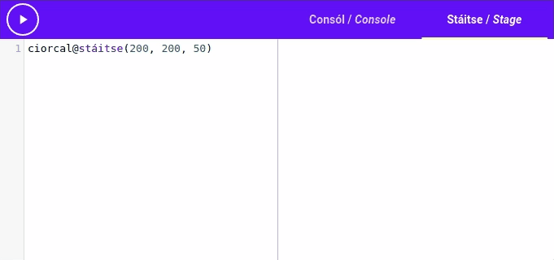
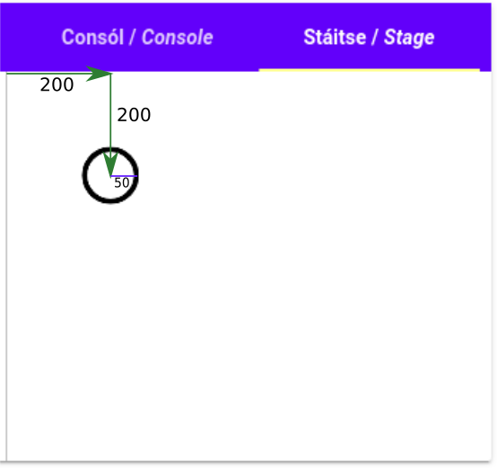

# Lights, Camera Actions!

To get started drawing [[shapes|cruthanna]] on the stage, we're going to need to first look
at **[[actions|gníomhartha]]**.

We've seen a few actions already, `scríobh`{.setanta} was an action, as well as `codladh`{.setanta}.

Actions are special values that represent an action the computer can take. In the case of `scríobh`{.setanta} that action was writing text on the console, and in the case of `codladh`{.setanta} that action was waiting for some time. In the future we'll see how to make our own actions, but for now we'll look at how to use them.

## Call me!

When we use an action, we say we are [["calling"|ag glaoch ar]] it. Remember how we used the `scríobh`{.setanta} action?

```{.setanta .numberLines}
scríobh("Write me on the console")
```

When the *Setanta* interpreter reads "`scríobh("Write me on the console")`{.setanta}" it knows to call the `scríobh`{.setanta} action, and to pass it the text `"Write me on the console"`{.setanta}.

The text in the brackets is called an [[*argument*|argóint]]. In the code above, the text `"Write me on the console"`{.setanta} is the argument to `scríobh`{.setanta}.

In the following code we saw before, `2000`{.setanta} is the argument to `codladh`{.setanta}:

```{.setanta .numberLines}
codladh(2000)
```

When this code is run, the computer passes `2000`{.setanta} to the `codladh` action and then calls it,
causing the program to sleep for 2 seconds.

### Multiple Arguments

Some actions in *Setanta* can take more than 1 argument. When we pass in more than 1 argument we use a [[comma|camóg]] ("`,`") to separate them.

For example: The `scríobh`{.setanta} action can take as many arguments as we want, and it will write them all out with a [[space|spás]] [[in between them|eatarthu]]. Try it out here:

{{{
scríobh("First-argument", "second-argument")
}}}

Not all actions can take as many arguments as you want. The `codladh`{.setanta} action needs exactly 1 argument, no more, no less.

*Some actions can also take 0 arguments*

## Challenge

Let's test our [[knowledge|eolas]] of actions!

Here is some code that uses `scríobh`{.setanta} to write "Setanta is fun!".
[[Change|Athraigh]] the code so that it still prints "Setanta is fun!", but uses three arguments instead.

{{{
scríobh("Setanta is fun!")
}}}

[[Click here to see the answer|scríobh(&quot;Setanta&quot;, &quot;is&quot;, &quot;fun!&quot;)]]

## Results

Some actions in *Setanta* return a value after they are called. We call this value the [[result|toradh]] of the action.

To see what I mean, here's a quick example. *Setanta* has an action called "[[`uas`{.setanta}|max]]". "uas" is short for "[[uasmhéid|maximum]]" which translates into English as "maximum".

So what does `uas`{.setanta} do? `uas`{.setanta} is an action that takes 2 numbers as arguments and returns the maximum.

E.g. The result of `uas(3, 2)`{.setanta} is 3.

We can assign variables to the result of actions like 

```{.setanta .numberLines}
biggest := uas(3, 2)
```

In this case, the value of `biggest` will be 3. Try it out here:

{{{
biggest := uas(3, 2)
scríobh(biggest)
}}}

*Note that we could also write `scríobh(uas(3, 2))`{.setanta}, using the result of `uas`{.setanta} as the argument for `scríobh`{.setanta} directly*

### Example from before

In our first intro to *Setanta* we saw this code:

```{.setanta .numberLines}
ainm := ceist("Cad is ainm duit?")
scríobh("Dia duit", ainm)
```

Now we know enough to see what's going on here!

1. First we use the `ceist`{.setanta} action to print "Cad is ainm duit?" on the console.
2. The user will type their name into the console, and the result will be returned by `ceist`{.setanta} and stored in the `ainm` variable.
3. Then we use the `scríobh`{.setanta} action to write "Dia duit" and the value of the `ainm` variable.

Try it out again to see this all in action!

{{{
ainm := ceist("Cad is ainm duit?")
scríobh("Dia duit", ainm)
}}}

**Try expanding this program to ask the user for their age too**

# Stage actions!

Now that we've learned all about actions, we can finally take to the stage.

We use actions to draw shapes and manipulate the stage. There are a lot of actions at our disposal.

Let's take at our first stage action "[[`ciorcal`{.setanta}|circle]]" which translates as "circle". This action allows us to draw circles on the stage. To access this action we have to [[type|clóscríobh]].

```{.setanta .numberLines}
ciorcal@stáitse
```

We'll see why we have to add the "`@stáitse`{.setanta}" part [[later on|níos déanaí]].

Try this code out:

{{{s
ciorcal@stáitse(200, 200, 50)
}}}

**Remember that you can use the tabs to switch between the console and the stage**.

You should see that this code drew a [[black circle|ciorcal dubh]] on the stage.



To understand what the arguments "`(200, 200, 50)`{.setanta}" mean, we'll take a look at [[coordinates|comhordanáidí]].

## Coordinates

Coordinates are a [[pair of numbers|péire uimhreacha]] that describe a [[point|pointe]] on the stage. Every point is described by a unique pair of numbers. For example, the top-left corner is the point (0, 0).

The first number in the pair tells you how far to the [[right|ar dheis]] the point is, and the second number tells you how far [[down|síos]].

E.g. The point (10, 20) can be found by starting in the top-left, moving 10 units to the right, and 20 units down.

We call the horizontal [[direction|treo]] the "x" direction, and the vertical direction the "y" direction.

When we call the `ciorcal` action, we pass in three arguments. The first is the "x" coordinate of the [[center|lár]] of the circle, the second is the "y" coordinate of the center, and the final argument is the [[radius|ga]]. So when we called `ciorcal@stáitse(200, 200, 50)`{.setanta} we were asking the *Setanta* interpreter to draw a circle on the stage, with the center at (200, 200) and radius 50.



## Colours

What if want to use different [[colours|dathanna]]? Luckily *Setanta* has an action just for that!

The "[[`dath`|colour]]" action can be used to change the colour of the [[pen|peann]]. As with the `ciorcal` action we call it with `dath@stáitse`{.setanta}. The `dath` action takes 1 argument, the colour you want to change to.

```{.setanta .numberLines}
dath@stáitse("dearg")
dath@stáitse("buí")
```

By changing our earlier code to first change the colour to [[green|glas]], we get a green circle instead:

{{{s
dath@stáitse("glas")
ciorcal@stáitse(200, 200, 50)
}}}

The `dath` action accepts colours in Irish and English, but also [HTML colour codes](https://htmlcolorcodes.com/)

## Other actions

You're not just limited to drawing circles! *Setanta* has a host of other actions to allow you to draw other shapes. We'll see more of them throughout the tutorial, but if you'd like to see the [[full list|liosta iomlán]] you can find it in [English here](https://docs.try-setanta.ie/en-docs/stage) or [in Irish here](https://docs.try-setanta.ie/ga-docs/st%C3%A1itse).
