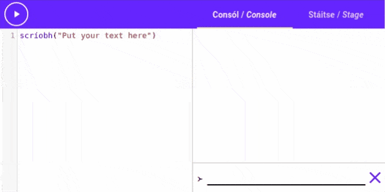

# Programming is...

Before we start [[learning|ag foghlaim]] how to write and use *Setanta*, we should ask:

> [[What is programming|Cad é ríomhchlarú]]?

[[Computers|Ríomhairí]] today are very [[smart|cliste]], they can do calculations no human could ever do in their head, and in the [[blink of an eye|i bhfaiteadh na súl]]. However, computers need a lot of [[help|cabhair]], and programming is how we help them.

When we write programs, we write down [[instructions|treoracha]] for the computer to [[follow|leanúint]]. The computer will read our instructions and follow them exactly.

### What's a programming language?

A [[programming language|teanga ríomhchlárúcháin]] is a language that the computer can understand, and we use it to write our instructions.

Modern programming languages are also designed so that people can understand them too. *Setanta* is one of those languages, but it's a little bit different.

Almost every programming language is designed to be close to English, but *Setanta* is different. When we write *Setanta* code, it's almost like we are writing the instructions in [[Irish|Gaeilge]].

### Syntax

Syntax is a fancy name for the set of rules that define a programming language. Spoken languages like Irish and [[English|Béarla]] also have a syntax, for example in English and Irish, every question must end with a question mark.

Programming languages have similar rules that define how you have to write things in the language.

# Simple instructions

To introduce programming and *Setanta*, let's look at some simple instructions.

## Scríobh

"[[Scríobh|Write]]" is the Irish word for "write". *Setanta* has an [[action|gníomh]] called `scríobh`{.setanta} that we can use to write [[text|téacs]] onto the console. We use the `scríobh`{.setanta} action like this:

```setanta
scríobh("Your text in here")
```

You can put any [[text|téacs]] you like in between the double quotes (") and `scríobh`{.setanta} will write it out on the console. Try it out here!

{{{
scríobh("Put your text here")
}}}

Change the text "Put your text here" to something else and run the code. See if you can make it print your name! Here's a quick GIF of something you could change it to.



### What if I can't type "í"?
**_Setanta_ understands that you might not know how to type fadas (áéíóú), so all of *Setanta*s built-in actions and keywords work just as well without the fadas.**

Try replacing `scríobh`{.setanta} with `scriobh`{.setanta} (no fada) in the code above and you'll see that it still works.

### What if I want to use a double quotes (") in my text?

You have two [[options|roghanna]] to use a double quote in your text, the first is to "[[escape|éalaigh]]" the double quote by writing "`\"`", like this:

```{.setanta .numberLines}
"This text has \"double quotes\" in it"
```

The [[second option|dara rogha]] is to use single quotes (') to define your text, like this:
```{.setanta .numberLines}
'This text has "double quotes" in it'
```
## Calculations

We've seen that *Setanta* can write text, but we can do much more than that. [[For example|Mar shampla]], *Setanta* can do [[calculations|áirimh]] for you! Run this code and see how *Setanta* does all the [[maths|matamaitic]] for you. *Setanta* will calculate the [[answer|freagair]] of "`28 + 36 * 2`{.setanta}" and write it on the console.

{{{
scríobh("Answer:", 28 + 36 * 2)
}}}

You can change the [[values|luachanna]] of the [[numbers|uimhreacha]] or add in more. Try replacing "`28 + 36 * 2`{.setanta}" with a different maths expression. You can use all the [[symbols|siombailí]] that you already know, for example:

> "`+`" for addition, "`-`" for subtraction, "`*`" for multiplication and "`/`" for division.

You can also use [[brackets|lúibíní]] to build up [[complicated|casta]] expressions, Try printing these with `scríobh`{.setanta} in the editor above:

```setanta
1 + 2 * (3 - 4) / 5
1 + 2 - (3 + (4 - 5))
```

You can also use numbers with decimal points, such as `1.2`{.setanta} or `123.4`{.setanta}

### Adding text

We can also use the `+` operator to add two pieces of text [[together|le chéile]]. Try it out:

{{{
scríobh("Dia" + " Duit")
}}}

## Comments

[[Sometimes|Uaireanta]] we want to write things in our programs that we don't want the computer to try and understand.
Often these are just little [[notes|notaí]] to ourselves, or [[explanations|mínithe]] of what something does.

[[Luckily|Ar an dea-uair]] there's a way to do this. If we write "`>--`{.setanta}" anywhere in the program, anything we write after it on the same line will be ignored by the computer. We call these entries [[comments|tráchtanna]]. Here's an example:

{{{
scríobh("Write me")
>-- The computer will ignore this :o
}}}

The computer only [[pays attention|tugann aird ar]] to the first line, and ignores the second.

Comments usually go until the end of the line, but we can end a comment early by typing "`--<`", these comments are called *inline comments*.

```{.setanta .numberLines}
scríobh(1 + >-- Inline comment --< 2)
```

# Combo Time

When the computer is following the instructions in our *Setanta* program. It starts at the top and works its way down the list. This means if we want to do one instruction after the other, all we have to do is put it on the next line. Check out this code:

{{{
scríobh("Before sleeping")
codladh(2000)
scríobh("After sleeping")
}}}

If you run this code, it will first print "[[Before sleeping|Roimh chodladh]]", then it will pause for 2 seconds and print "[[After sleeping|Tar éis codlata]]". This is because we used the [[`codladh`{.setanta}|sleep]] action.  "Codladh" translates into English as "sleep". We use `codladh`{.setanta} when we want the computer to [[wait|fán]] for a while before moving on to the next instruction.

The `codladh`{.setanta} action takes a number of milliseconds (in this case 2000), and when the computer reaches the `codladh`{.setanta} instruction, it will wait for that many milliseconds before proceeding.

The steps the computer takes are:

1. [[Read|Léigh]] the first line "`scríobh("Before sleeping")`{.setanta}" and write "Before sleeping" on the console as instructed.
2. Read the second line "`codladh(2000)`{.setanta}" and sleep for 2000 [[milliseconds|milleasoicindí]] (2 [[seconds|soicindí]]).
3. Read the third line "`scríobh("After sleeping")`{.setanta}" and write "After sleeping" on the console.
4. [[Finished|Críochnaithe]].

# Variables

One of the most [[important|tábhachtach]] abilities that a computer has is [[memory|cuimhne]]. When we write a program, we can ask the computer to remember certain values, and we can ask it to recall them later. To do this we use something called a [[variable|athróg]].

A variable is like a container that we can put a value inside. We can name the container and use the name when we want to refer to the container.

## Making variables

To make a new variable we use the "`:=`{.setanta}" symbol. For example

```{.setanta .numberLines}
bia := "sceallóga"
```

This code makes a new variable called [[`bia`|food]], and stores the value [[`"sceallóga"`{.setanta}|chips]] in that variable. Now if we called `scríobh(bia)`{.setanta} it would remember that we asked it to store "sceallóga" in the variable `bia`, and it would write "sceallóga" on the console.

Try it out now!

{{{
bia := "sceallóga"
scríobh(bia)
}}}

## Updating variables

When you make a variable, it's value is not fixed forever. You can change the value of the variable throughout your program. When we want to change the value of a variable we use a single equals sign (`=`). This is different from the `:=` symbol used to make a new variable.

Try running this program here:

{{{
>-- Make a variable "ainm" with the value "Setanta"
ainm := "Setanta"
scríobh(ainm)
>-- Change the value of "ainm" to be "Cú Chulainn"
ainm = "Cú Chulainn"
scríobh(ainm)
}}}

Notice how the first time `ainm` is printed, the value is `"Setanta"`{.setanta}, but the second time it is `"Cú Chulainn"`{.setanta}. This is because the value of the variable has been changed.

We can actually make reference to the old value of a variable when we update a variable. Take a look at this code:

{{{
x := 2
x = x + 10
scríobh(x)
}}}

When this code is run it writes 12 on the console.

### Explanation

1. The first line creates a new variable called `x`, with the value 2.
2. The second line tries to update `x` with a new value, which it gets by calculating `x + 10`{.setanta}. This evaluates to 12 because the current value of `x` is 2. We then store this new value of 12 into the variable `x`.
3. The third line then writes the value of `x` on the console, which is now 12.

## Challenge

Change this code so that it writes [[`"bainne"`{.setanta}|milk]] on the console:

{{{
bia := "sceallóga"
scríobh(bia)
}}}

[[Click here for the answer|Change the first line to bia := &quot;bainne&quot;]]

# What's next?

Now that we've seen some simple instructions for using the console, we've explored how to sequence instructions and learned how to store values in memory, we can use these new abilities on the stage!
